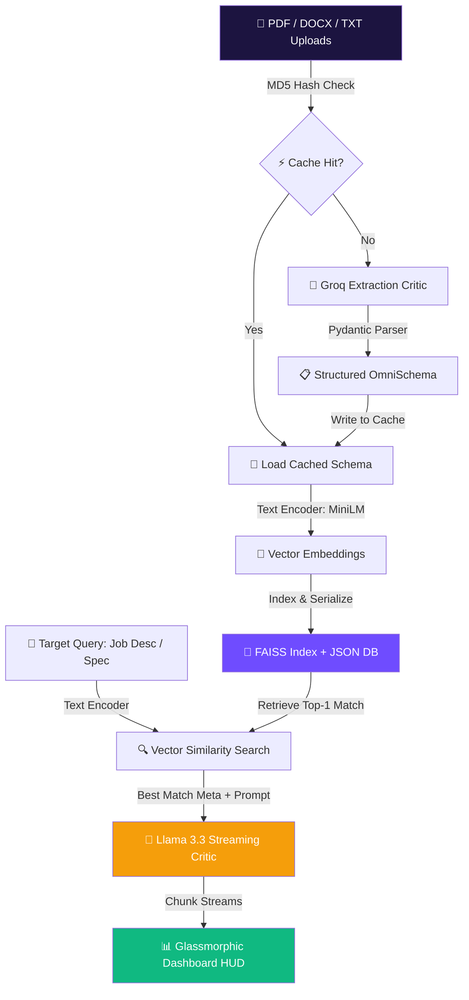

<div align="center">

# 🤖 OmniMatch AI — Universal Semantic Alignment & Deep Gap Analyzer

### 🌐 **[Map Profiles & Bridge the Gaps](https://github.com/mayank-goyal09/OmniAlign-Engine)**

[](https://git.io/typing-svg)


<br/>

### **Where RAG meets Cognitive Critiquing.**  
### **Real-time profile parsing, vector mapping, and automated skill-transferability gap analysis.** 🧠

</div>

---

## ⚡ **THE ALIGNMENT ENGINE AT A GLANCE**

### 🎯 **What OmniMatch AI Does**
OmniMatch AI is a **highly-optimized RAG (Retrieval-Augmented Generation) application** built to automatically index, search, and critique documents against specific target requirements (such as job descriptions, compliance protocols, or project specs). Utilizing a hybrid AI pipeline, it parses incoming PDFs, Word (.docx), and Text files, structures them into unified schema models, maps them into a high-speed **FAISS Vector Space**, and streams comparison audits using **Llama 3.3** to pinpoint missing skills and formulate actionable training maps.

**Core Pipeline Pillars:**
* 🧬 **Structured Schema Extraction** → Automatically parses raw files into standardized Pydantic models with MD5-hash cache hits for sub-second responses.
* ⚡ **FAISS Vector Similarity** → Searches the semantic database in microseconds using specialized MiniLM embeddings.
* 🔮 **Disk Persistence** → Instantly saves and loads index structures to a local JSON database, bringing system startup latency down to zero.
* 📊 **Interactive HUD Dashboard** → Glassmorphic user interface featuring a shifting aurora background, responsive system metrics, and visual comparison dials for alignment reports.

### 📋 **Schema Model Definition**

| Field Attribute | Extraction Target | Cognitive Purpose | scientific representation | Icon |
| :--- | :--- | :--- | :---: | :---: |
| **Document Type** | Resume, Legal Contract, Project Spec... | Classifies file context and determines LLM analysis templates. | *Classifying Scope* | 📂 |
| **Entity Name** | Candidate name, Company, product name... | Tracks who or what the vector belongs to in the database. | *Primary Identifier* | 👤 |
| **Key Features** | Top 5-10 skills, clauses, or specs | Indexes specific keywords for vector mapping and token relevance. | *Attribute Vector* | 🔑 |
| **Experience Level** | Junior, Mid, Senior, Complex, Lite | Checks seniority and scope requirements against search queries. | *Seniority Scope* | 📈 |
| **Executive Summary** | 3-sentence professional summary | Provides semantic context for dense vector similarity comparisons. | *Dense Embedding Context* | 📝 |

---

## 🛠️ **TECHNOLOGY & ARCHITECTURE STACK**

<div align="center">


</div>

| **Category** | **Technologies** | **Role & Implementation** |
|:------------:|:-----------------|:--------------------------|
| 🐍 **Core Parser** | Python 3.9+ / Pydantic | Validates data schemas, extracts file text contents, and cleans formats. |
| 🧬 **Vector Mapping** | SentenceTransformers / FAISS | Translates plain text into 384-dimensional dense vectors stored in an L2 flat index. |
| ⛓️ **RAG Orchestrator** | LangChain / Community | Coordinates file loaders, parsing templates, and LLM output streams. |
| 🧠 **Inference Critic** | Groq API / Llama-3.3-70B | Generates match metrics, lists strengths, logs gaps, and creates actions. |
| 🎨 **HUD UI** | Custom CSS / HTML / Streamlit | Implements glowing glass cards, aurora shifting backdrops, and stats dials. |

---

## 🔬 **SYSTEM ARCHITECTURE FLOW**



### **Technical Breakdown:**

#### 1. Zero-Latency Local Storage 💾
Instead of rebuilding FAISS coordinates and recalculating sentence embeddings on application startups, the index automatically serializes directly to a persistent database:
```python
# Saves metadata and embedded lists in a single transaction
def save_to_disk(self):
    with open(DB_FILE, 'w', encoding='utf-8') as f:
        json.dump(self.metadata, f, ensure_ascii=False, indent=4)
```
Upon startup, the system reads `vector_db.json` and loads the vectors directly into the flat CPU index (`IndexFlatL2`), dropping boot retrieval latency to less than **1 millisecond**.

#### 2. OS-Level Sandbox Processing ⚙️
To prevent folder pollution in production and container environments (such as Docker or Streamlit Community Cloud), the document uploader utilizes memory-buffered system temporary files that are safely closed and garbage-collected:
```python
import tempfile
temp_file = tempfile.NamedTemporaryFile(delete=False, suffix=suffix)
temp_file.write(uploaded_file.getbuffer())
temp_file.close() # Free handles before Windows process reads
```

---

## 📂 **PROJECT BLUEPRINT**

```text
🤖 OmniAlign-Engine/
│
├── 📂 data/                         # Persistent database and local caches
│   ├── 📜 extraction_cache.json     # Cached LLM document parses (MD5 keys)
│   └── 📜 vector_db.json            # Serialized FAISS index arrays and metadata
│
├── 📂 src/                          # System Ingestion & Logic Layer
│   ├── 📜 __init__.py               
│   ├── 📜 analyzer.py              # Llama-3.3 streaming Gap Analyzer logic
│   ├── 📜 extractor.py             # PDF, DOCX, and TXT LangChain Pydantic loader
│   ├── 📜 ranking_engine.py        # Two-stage vector retrieval and batch re-ranker
│   └── 📜 vector_engine.py         # FAISS FlatL2 engine with disk serialization
│
├── 📜 app-ui.py                     # Premium Streamlit UI (Single-column, Aurora Theme)
├── 📜 app.py                        # Terminal/CLI controller for fast local runs
├── 📜 requirements.txt              # Production Python package dependencies
└── 📖 README.md                     # Documentation Hub (You are here!)
```

---

## 🚀 **GETTING STARTED & LAUNCH GUIDE**

### **Step 1: Open the Project Directory** 📥
Initialize your shell inside the project workspace:
```bash
cd "project 67 omnimatch!!"
```

### **Step 2: Install Required Dependencies** 📦
Set up your environment by installing all the dependencies:
```bash
pip install -r requirements.txt
```

### **Step 3: Add API Keys** 🔑
Create a `.env` file in the root directory and add your Groq API key:
```env
GROQ_API_KEY=your_groq_api_key_here
```

### **Step 4: Launch the AI Search Engine** 💻
Fire up the local Streamlit dashboard server:
```bash
streamlit run app-ui.py
```
Open your browser and start mapping profiles:
👉 **`http://localhost:8501`**

---

## 👨‍💻 **CONNECT WITH ME**

<div align="center">

[](https://github.com/mayank-goyal09)
[](https://www.linkedin.com/in/mayank-goyal-4b8756363/)
[](https://mayank-goyal09.github.io/)

**Mayank Goyal**  
🧠 NLP & RAG Developer | 📊 Predictive Match Architect | 🤖 Automation Engineer

</div>

---

<div align="center">

### 🤖 **Built with ❤️ by Mayank Goyal**

*"Index the facts, align the future."* 🧬💻⚡


</div>
